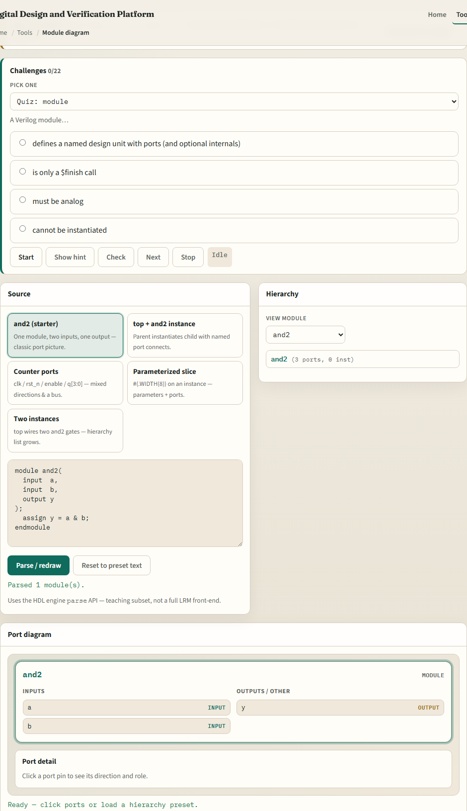
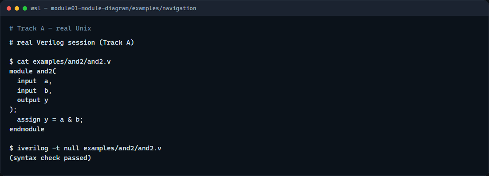

# Module / port diagram

Every RTL block starts with a boundary you can draw on paper

---

## Modules, ports, and instances
- A module is a named design unit
- Ports are the named wires on its edge, input, output, or inout
- Inside the module you describe behavior with assigns or always blocks
- Named connects like dot-a open-paren a close-paren tie a formal port to an actual wire
- Hierarchy is simply the tree of parents and instances you get when one module contains

---

## Browser lab

---

## Real Verilog practice

---

## Pitfalls to watch
- Do not swap input and output directions, a port driven inside must be an output
- Do not assume positional port order when named connects are clearer
- And remember

---

## Your turn
- Complete the checklist for at least one track, preferably both
- In the browser, load the starter and finish a few challenges
- On real Verilog, write or edit a minimal module shell for this idea
- When you are ready

