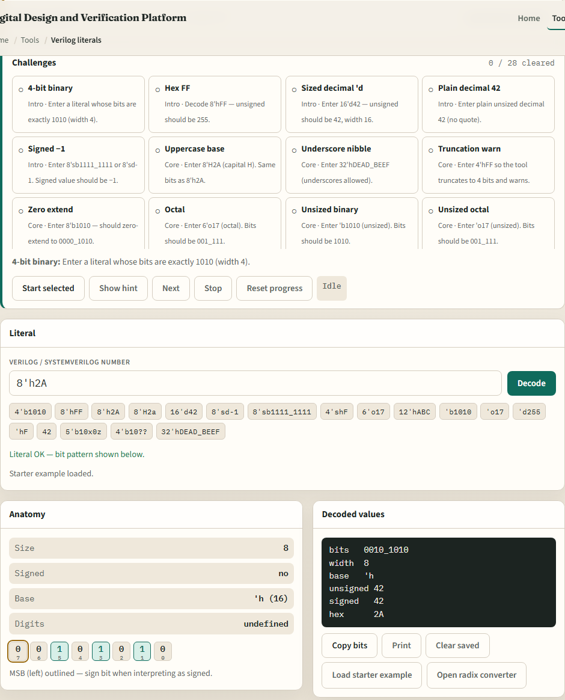
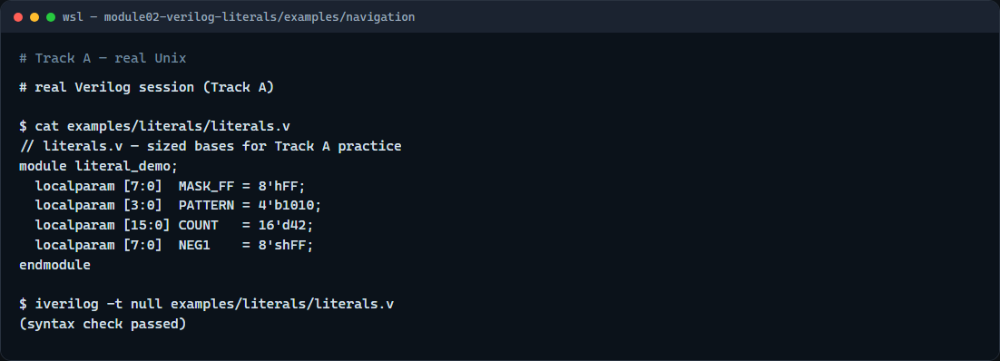

# Verilog literals

Constants show up everywhere in RTL, reset values, parameter defaults, and compare masks

---

## How literals are built
- A sized literal has three parts
- Eight apostrophe h F F is eight bits of all ones
- An unsized literal like apostrophe b one zero one zero still has a base but lets the tool
- Add s after the apostrophe for signed interpretation
- Underscores between nibbles are cosmetic; they do not change the value

---

## Browser lab

---

## Real Verilog practice

---

## Pitfalls to watch
- Do not ignore width, four apostrophe h F F truncates to four bits
- Do not treat signed and unsigned as interchangeable
- X and Z are for simulation and unknown states
- And remember

---

## Your turn
- Complete the checklist for at least one track, preferably both
- In the browser, load the starter and finish a few challenges
- On real Verilog, write or edit a minimal sketch with at least two different bases
- When you are ready

