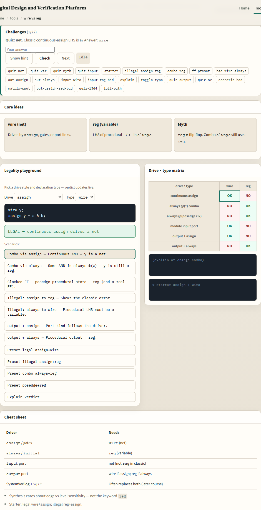
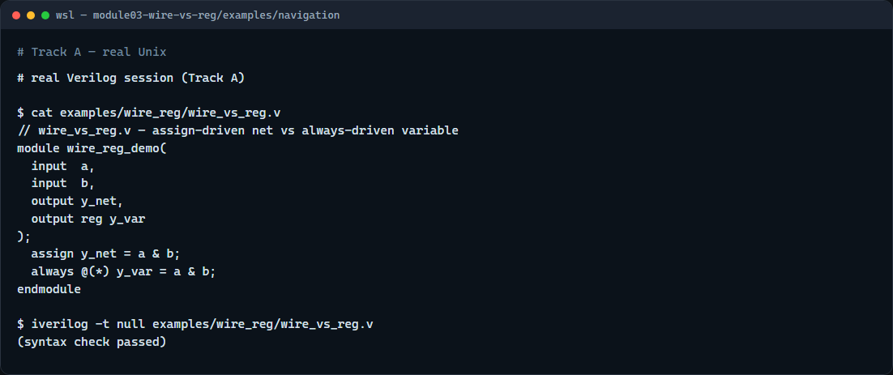

# wire vs reg

Classic Verilog splits names into two families: nets, declared with wire, and variables, declared with reg

---

## Nets versus variables
- A wire is a net
- You drive it with continuous assign
- A reg is a variable
- You drive it inside procedural blocks
- Input ports are nets in IEEE 1364
- Output can be a net if assign drives it, or a reg if always drives it

---

## Browser lab

---

## Real Verilog practice

---

## Pitfalls to watch
- Do not read reg as “register hardware”, combo always blocks still need a reg on the left
- Do not continuous-assign a reg or procedural-assign a wire
- SystemVerilog logic blurs the picture in later courses
- And remember

---

## Your turn
- Complete the checklist for at least one track, preferably both
- In the browser, load the starter and finish a few challenges
- On real Verilog
- When you are ready

