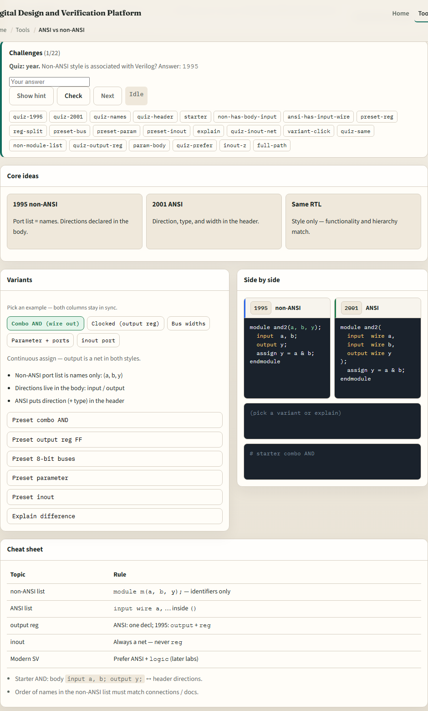
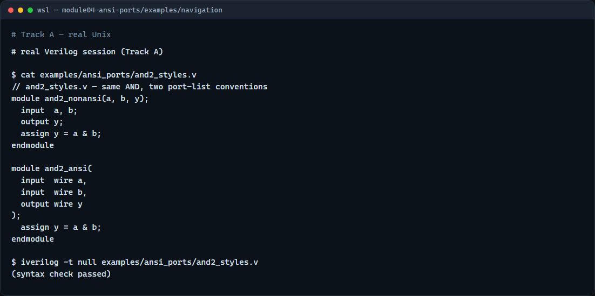

# Module 04 — ANSI vs non-ANSI ports

**Module id:** module04-ansi-ports  
**Lab:** ansi-ports  
**Tracks:** A · B

## Slide 1 — ANSI vs non-ANSI ports

You have seen module boundaries and port directions—now the question is where those directions are written. Verilog-1995 lists port names in the header and declares input or output inside the module body. Verilog-2001 ANSI style puts direction, type, and width right in the port list. This module is that style split: same hardware, two header conventions.

## Slide 2 — Two header styles

In non-ANSI style, the module line might read module and-two open-paren a, b, y close-paren semicolon, then input a and b and output y appear as separate lines in the body. In ANSI style, the header carries the full picture: input wire a, input wire b, output wire y. For a clocked output you might write output reg q in ANSI, while non-ANSI often says output q semicolon then reg q semicolon on the next lines. Bus widths and parameters follow the same pattern—the information moves from body to header, not the function.

## Slide 3 — Browser lab



In the browser lab track, open the ANSI versus non-ANSI ports lab from the tools page. You will see challenges at the top, variant presets in the middle, and two code columns side by side—nineteen ninety-five on the left, two thousand one ANSI on the right. Load the starter example for the combo AND gate and compare the headers. Switch to the clocked output reg preset or the eight-bit bus preset and watch what moves between columns. Work a few challenges, then use Check when the view matches the prompt.

## Slide 4 — Real Verilog practice



In the real Verilog track, open this module’s examples folder and read the paired AND sketches. One module uses the classic name list plus body directions; the other uses an ANSI header with wire on the ports. The assign inside is identical. If Icarus is available, run a syntax-only compile on the file—both modules can live in one file for learning. In new code you will almost always write ANSI headers; you still need to read legacy non-ANSI when you inherit older RTL.

```verilog
// and2_styles.v — same AND, two port-list conventions
module and2_nonansi(a, b, y);
  input  a, b;
  output y;
  assign y = a & b;
endmodule

module and2_ansi(
  input  wire a,
  input  wire b,
  output wire y
);
  assign y = a & b;
endmodule

// iverilog -t null and2_styles.v — syntax check only
```

## Slide 5 — Pitfalls to watch

Do not assume non-ANSI means wrong—it is still valid IEEE 1364, just older layout. Do not forget that output reg in ANSI replaces the separate output and reg lines in the body. Mixing styles in one module is confusing—pick one convention per file. And remember: the lab compares syntax only; tri-state inout and parameter blocks have their own presets to explore separately.

## Slide 6 — Your turn

Complete the checklist for at least one track—preferably both. In the browser, load the starter and finish a few challenges. On real Verilog, write or edit one ANSI port list and be able to point at the non-ANSI equivalent. When you are ready, take the short quiz, then continue to operators in the next module.
