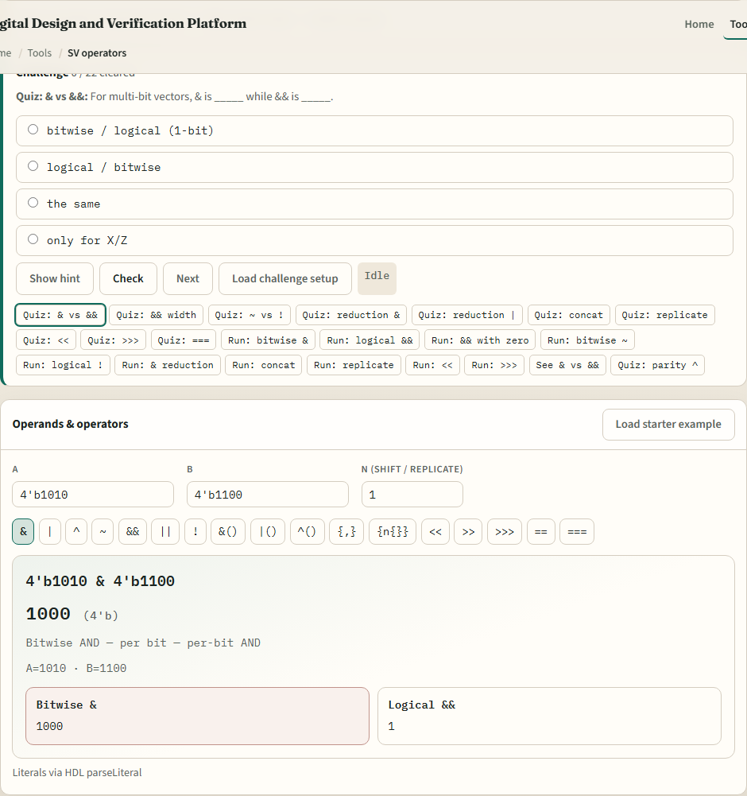
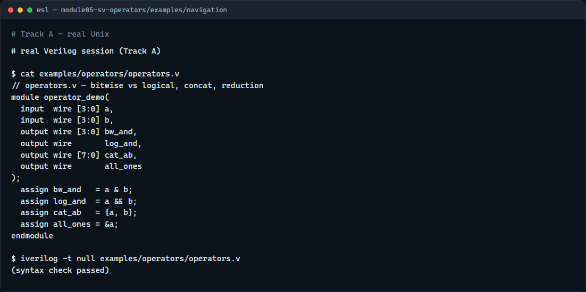

# Operators

RTL is mostly expressions: AND gates, compares, shifts, and bus packing

---

## Bitwise, logical, and reductions
- Bitwise operators, ampersand, pipe, caret, tilde, work per bit on vectors of any width
- Logical operators
- All bits ANDed, any bit ORed, or parity XOR
- Concatenation braces glue vectors left to right; replication repeats a pattern
- Shifts move bits with zero fill or, for arithmetic right shift, sign-bit fill

---

## Browser lab

---

## Real Verilog practice

---

## Pitfalls to watch
- Do not swap bitwise and logical AND
- Do not confuse concat order: left operand becomes the upper bits
- Arithmetic right shift fills with the sign bit; logical right shift fills with zero
- And remember

---

## Your turn
- Complete the checklist for at least one track, preferably both
- In the browser, load the starter and finish a few challenges
- On real Verilog
- When you are ready

