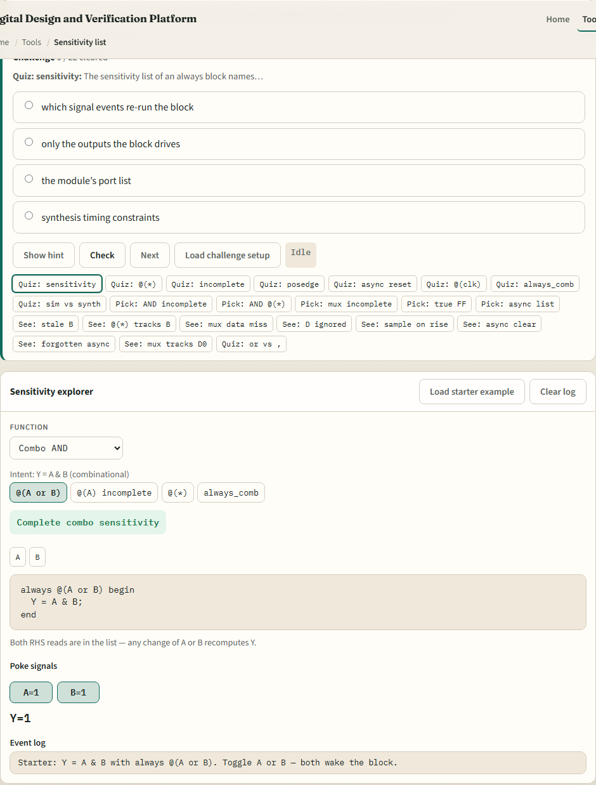
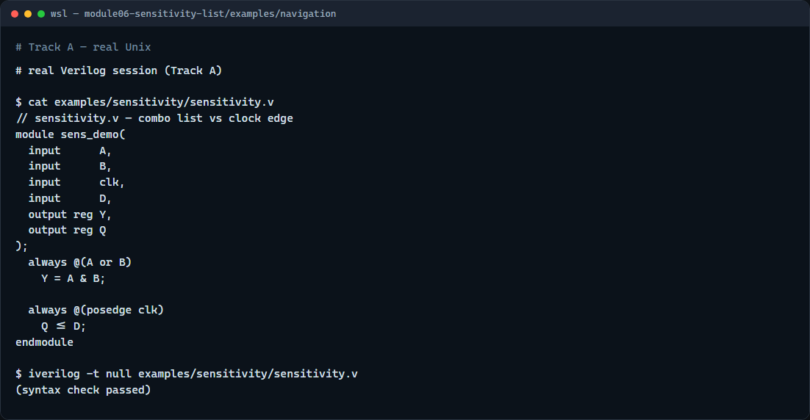

# Module 06 — Sensitivity lists

**Module id:** module06-sensitivity-list  
**Lab:** sensitivity-list  
**Tracks:** A · B

## Slide 1 — Sensitivity lists

An always block does not run on every tick of simulation time—it runs when a signal in its sensitivity list changes the way the list specifies. This module is that contract: which events wake combinational logic, what happens when the list is incomplete, and how edge lists differ for flip-flops. We will poke signals in the browser explorer, then write the same patterns in real Verilog.

## Slide 2 — What wakes an always block

For combinational logic, every signal you read on the right-hand side should appear in the list—or you use at-star so the tool builds the list for you. Classic Verilog wrote at open-paren A or B close-paren; Verilog-2001 added at-star as shorthand. If you list only A but also read B, a change on B alone may not re-run the block and the output can stay stale in simulation. For sequential logic, posedge clk means the block runs only on a rising clock edge; D can change all day without updating Q until that edge.

## Slide 3 — Browser lab



In the browser lab track, open the sensitivity-list explorer from the tools page. You will see challenges at the top, a function picker, style tabs for different sensitivity forms, signal poke buttons, and an event log. Load the starter example—Y equals A AND B with always at open-paren A or B close-paren. Flip A or B and watch the block fire. Switch to the incomplete at-open-paren A close-paren style and flip only B—see Y go stale. Try the flip-flop scenario with posedge clk next. Work a few challenges, then use Check when the log matches the prompt.

## Slide 4 — Real Verilog practice



In the real Verilog track, open this module’s examples folder and read the sensitivity demo. One always block lists A or B for combinational Y; another uses posedge clk for registered Q. That split—level or star for combo, clock edge for storage—is the pattern you will see in every RTL file. If Icarus is available, run a syntax-only compile. Match the sensitivity style to how the block is meant to behave.

```verilog
// sensitivity.v — combo list vs clock edge
module sens_demo(
  input      A,
  input      B,
  input      clk,
  input      D,
  output reg Y,
  output reg Q
);
  always @(A or B)      // combo: wake on A or B change
    Y = A & B;

  always @(posedge clk) // seq: sample D on rising clk
    Q <= D;
endmodule

// iverilog -t null sensitivity.v — syntax check only
```

## Slide 5 — Pitfalls to watch

Do not hand-write or lists and forget a signal you read—the lab’s incomplete-A example is a real simulation bug. Do not use level-sensitive at open-paren clk close-paren when you mean a flip-flop—posedge clk is the synthesizable idiom. At-star fixes combo lists in modern Verilog; SystemVerilog always_comb goes further with tool checks. And remember: the explorer is a teaching model—your synthesis flow still needs correct sensitivity in committed RTL.

## Slide 6 — Your turn

Complete the checklist for at least one track—preferably both. In the browser, load the starter, try the incomplete list, and poke the flip-flop scenario. On real Verilog, write or edit one combo always and one clocked always with the right sensitivity. When you are ready, take the short quiz, then continue to latch risk in the next module.
