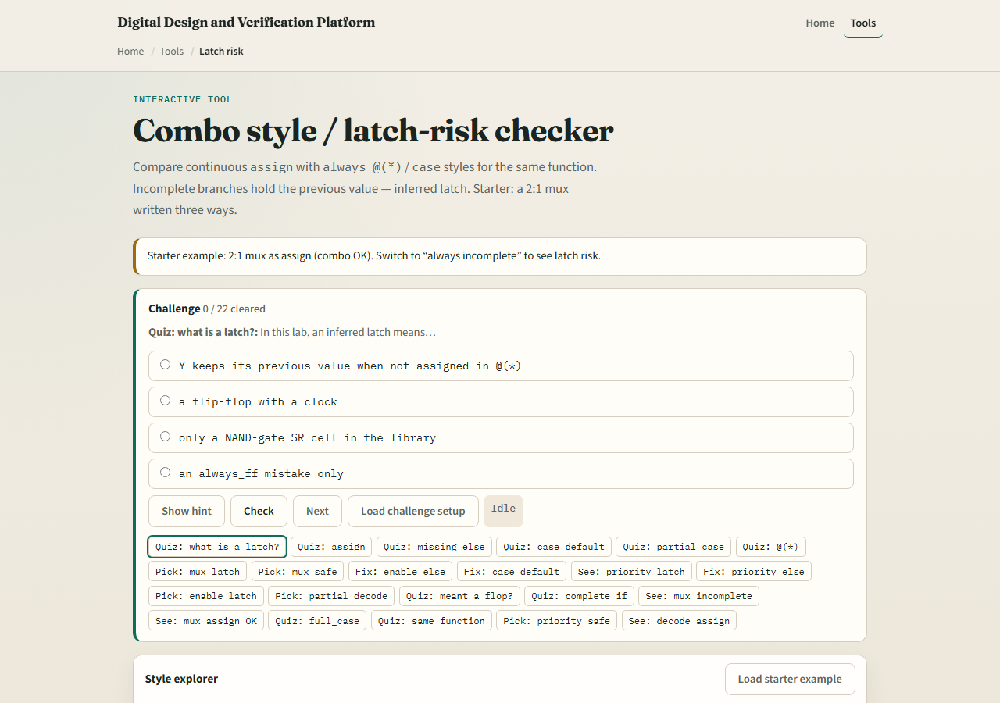
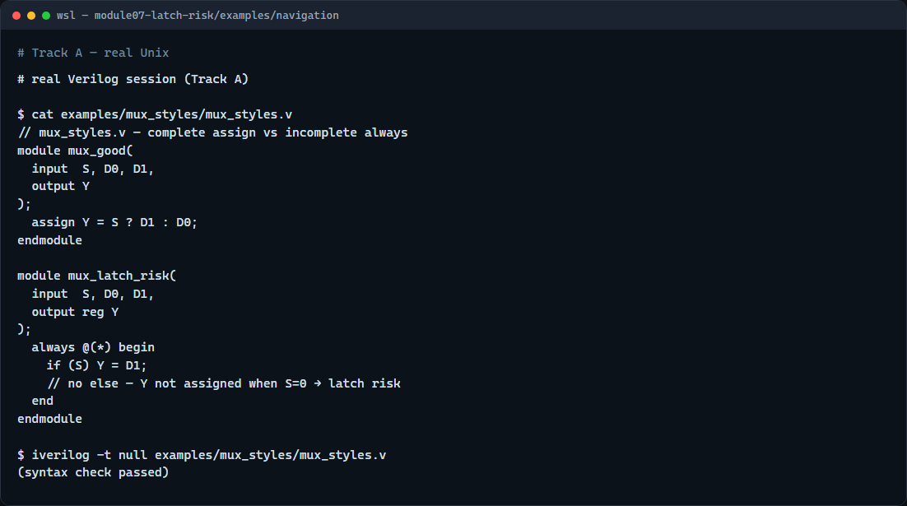

# Module 07 — Latch risk

**Module id:** module07-latch-risk  
**Lab:** latch-risk  
**Tracks:** A · B

## Slide 1 — Latch risk

Combinational logic should depend only on current inputs—not on what the output was last cycle. When an always block at-star leaves a variable unassigned on some input combination, synthesis may infer a latch to hold the previous value. This module is that failure mode: incomplete if branches, partial case statements, and how assign differs from procedural combo style.

## Slide 2 — Complete versus incomplete paths

A continuous assign is purely combinational—there is no path where Y fails to update. In always at-star, every input combination must drive every output you intend to be combinational. If you write only if open-paren S close-paren Y equals D1 with no else, then when S is zero Y is not assigned and tools infer storage. A full if-else or a case with all labels covered—or a default—gives every path a value. At-star fixes sensitivity; it does not fix missing branches.

## Slide 3 — Browser lab



In the browser lab track, open the latch-risk checker from the tools page. You will see challenges at the top, a function picker for the two-to-one mux, style tabs comparing assign versus always forms, and a latch verdict with sample code. Load the starter example and flip between assign, complete always, and incomplete always. Toggle the else checkbox on the priority-if scenario and watch the verdict change. Work a few challenges, then use Check when you picked the risky style.

## Slide 4 — Real Verilog practice



In the real Verilog track, open this module’s examples folder and compare two mux sketches. One uses continuous assign—latch-free by construction. The other uses always at-star with only the true branch of if—classic latch bait. If Icarus is available, run a syntax-only compile; both parse, but only the first is safe combinational style for synthesis. Your linter and synthesis reports are where latch inference shows up in real projects.

```verilog
// mux_styles.v — complete assign vs incomplete always
module mux_good(
  input  S, D0, D1,
  output Y
);
  assign Y = S ? D1 : D0;
endmodule

module mux_latch_risk(
  input  S, D0, D1,
  output reg Y
);
  always @(*) begin
    if (S) Y = D1;
    // no else — Y not assigned when S=0 → latch risk
  end
endmodule

// iverilog -t null mux_styles.v — syntax check only
```

## Slide 5 — Pitfalls to watch

Do not assume at-star means latch-free—it only builds the sensitivity list. Do not write enable-looking if open-paren EN close-paren without else unless you deliberately want a latch—and in coursework you usually do not. Partial case without default is the same class of bug for wider selects. Prefer assign or always_comb with every path assigning outputs when you mean pure combinational logic.

## Slide 6 — Your turn

Complete the checklist for at least one track—preferably both. In the browser, load the starter and identify which mux style infers a latch. On real Verilog, write or fix an always block so every branch assigns the output. When you are ready, take the short quiz, then continue to blocking versus non-blocking in the next module.
