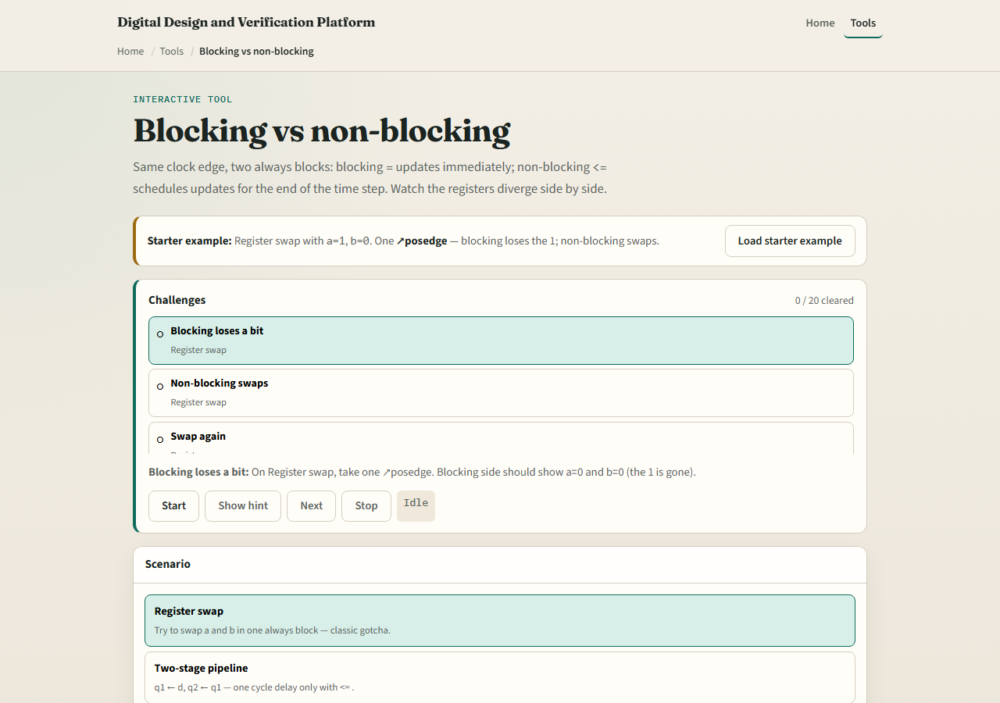
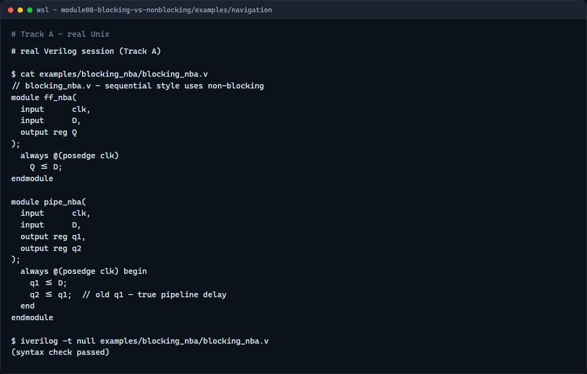

# Blocking vs non-blocking

In a clocked always block, equals is blocking assignment and less-than-or-equals is non-blocking

---

## Same edge, different story
- Picture a two-stage pipeline: q1 gets d, then q2 gets q1
- With blocking
- With non-blocking, q2 still sees the old q1, so you get a real one-cycle delay per stage
- The swap gotcha is the same idea
- Rule of thumb

---

## Browser lab

---

## Real Verilog practice

---

## Pitfalls to watch
- In coursework you usually do not
- Do not mix blocking and non-blocking on the same register in one edge without a clear
- Do not use non-blocking in combinational at-star blocks, it is for sequential logic
- If your pipeline shows zero delay between stages, check for blocking assignments first

---

## Your turn
- Complete the checklist for at least one track, preferably both
- In the browser
- On real Verilog
- When you are ready

