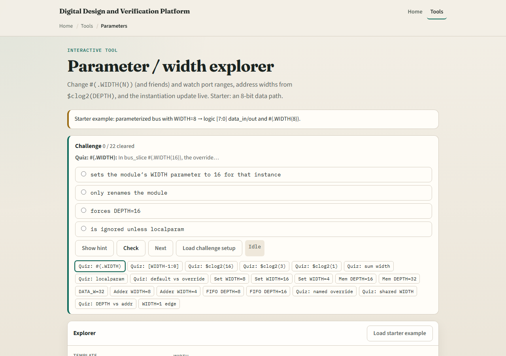
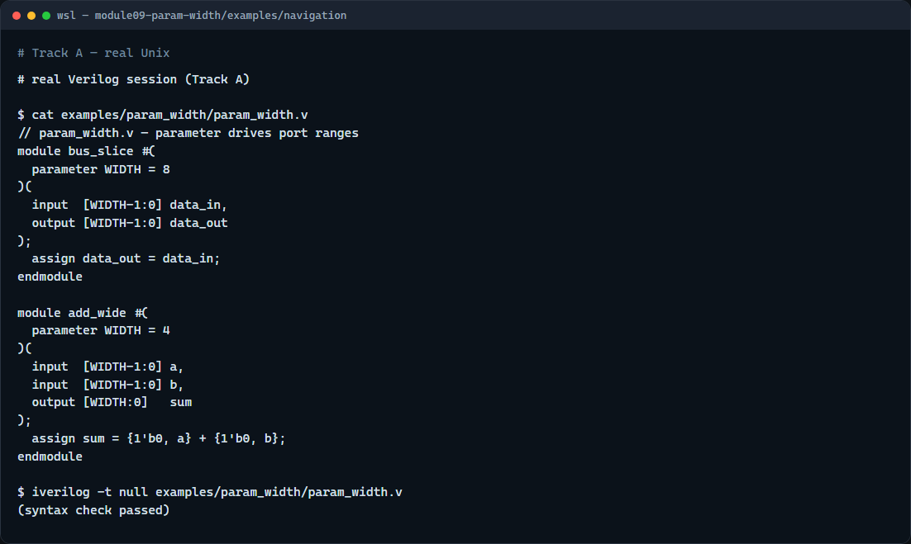

# Parameter and width

Reusable RTL names its bus widths once and threads them through ports, locals, and instances

---

## One knob, many places
- Declare parameter WIDTH equals eight
- No hand-editing every bracket
- For memory, DEPTH sets how many words you have; address width tracks clog-two of depth
- For an adder, operands stay WIDTH wide but the sum is often WIDTH plus one to hold carry
- Localparam is the same idea but fixed inside the module

---

## Browser lab

---

## Real Verilog practice

---

## Pitfalls to watch
- Do not hard-code bracket seven colon zero everywhere when WIDTH might change
- Do not forget sum needs WIDTH plus one when adding two WIDTH-bit values
- Do not assume clog-two of depth is always at least one
- Do not confuse parameter overrides at instantiation with port wiring

---

## Your turn
- Complete the checklist for at least one track, preferably both
- In the browser, set WIDTH to sixteen and state the MSB index and bracket range
- On real Verilog, add a parameter to a module and override it in one instance
- When you are ready

