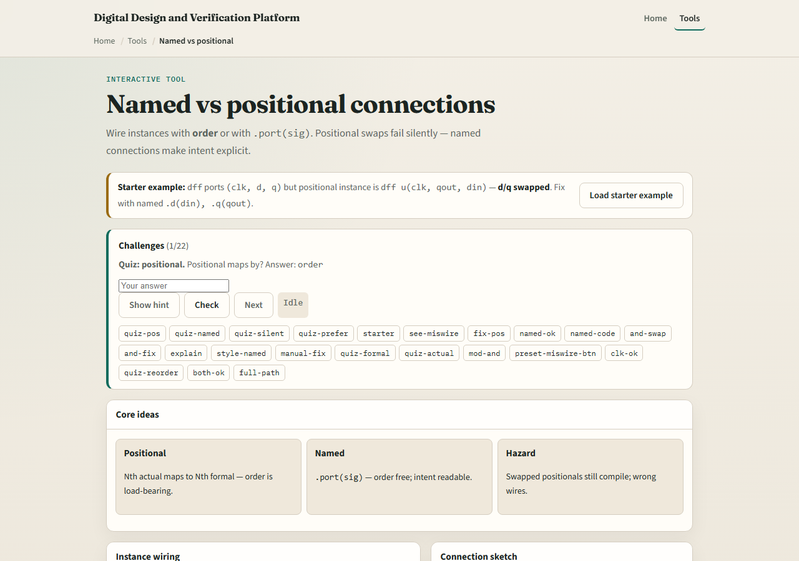
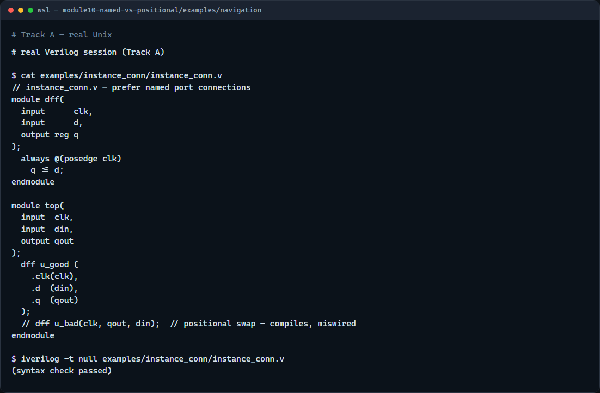

# Named vs positional

When you instantiate a module, you must connect its ports to nets in your design

---

## Order matters for positional
- A D flip-flop might declare ports clk, d, q in that order
- Positional dff u open-paren clk, din, qout close-paren wires them correctly
- Swap the last two arguments to clk
- Named dot-d open-paren din close-paren dot-q open-paren qout close-paren makes the intent
- For a two-input AND gate, swapping a and b is harmless

---

## Browser lab

---

## Real Verilog practice

---

## Pitfalls to watch
- Do not assume positional order matches how you drew the schematic
- Do not mix named and positional on the same instance unless your style guide allows it
- Do not rely on the compiler to catch swapped functional ports
- For generated or macro cells with dozens of ports

---

## Your turn
- Complete the checklist for at least one track, preferably both
- In the browser
- On real Verilog, rewrite one instance using named ports
- When you are ready, take the short quiz, then continue to localparam in the next module

