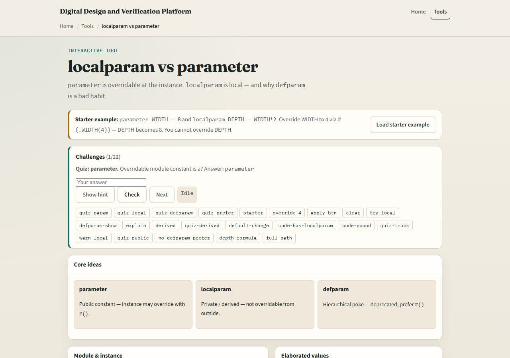
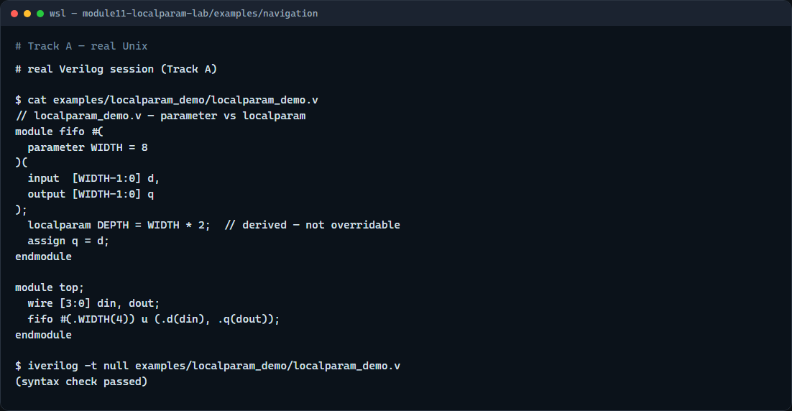

# Module 11 — localparam

**Module id:** module11-localparam-lab  
**Lab:** localparam-lab  
**Tracks:** A · B

## Slide 1 — localparam

A parameter is a compile-time constant the parent can override at instantiation with hash-dot syntax. A localparam is also fixed at elaboration time, but it cannot be overridden from outside the module—it is for derived values that should track your parameters automatically. This module is that split: public knobs versus private constants, and why trying to override a localparam is a mistake.

## Slide 2 — Public knob, private derivation

Declare parameter WIDTH equals eight as the tunable bus width. Then localparam DEPTH equals WIDTH times two—memory depth derived from width, not exposed at the boundary. Instantiate fifo hash-dot WIDTH open-paren four close-paren and WIDTH becomes four while DEPTH recomputes to eight. Hash-dot DEPTH open-paren ninety-nine close-paren is illegal or ignored—DEPTH is local. The pattern parameter W, then localparam MSB equals W minus one, keeps bracket math in one place when W changes.

## Slide 3 — Browser lab



In the browser lab track, open the localparam-versus-parameter lab from the tools page. You will see cards for parameter, localparam, and the discouraged defparam habit, plus sliders for default and override WIDTH. Load the starter, apply hash-dot WIDTH open-paren four close-paren, and watch elaborated DEPTH track WIDTH times two. Try the illegal DEPTH override button and read the warning. Work the quiz challenges, then use Check.

## Slide 4 — Real Verilog practice



In the real Verilog track, open this module’s examples folder. The fifo sketch declares parameter WIDTH with a default, localparam DEPTH as WIDTH times two, and a top-level that overrides WIDTH to four at instantiation. If Icarus is available, run a syntax-only compile—the point is which names are overridable, not simulating the full memory array.

```verilog
// localparam_demo.v — parameter vs localparam
module fifo #(
  parameter WIDTH = 8
)(
  input  [WIDTH-1:0] d,
  output [WIDTH-1:0] q
);
  localparam DEPTH = WIDTH * 2;  // derived — not overridable
  assign q = d;
endmodule

module top;
  wire [3:0] din, dout;
  fifo #(.WIDTH(4)) u (.d(din), .q(dout));
endmodule

// iverilog -t null localparam_demo.v — syntax check only
```

## Slide 5 — Pitfalls to watch

Do not put every constant in parameter form—parents should not override derived widths like MSB or DEPTH. Do not use defparam for new code; prefer hash-dot at the instance. Do not assume a localparam override fails loudly in every tool—some flows ignore it, which hides mistakes. Do keep parameter for instance-visible knobs and localparam for math that must stay in sync inside the module.

## Slide 6 — Your turn

Complete the checklist for at least one track—preferably both. In the browser, override WIDTH to four and state the new DEPTH. On real Verilog, add a localparam derived from an existing parameter. When you are ready, take the short quiz, then continue to generate and replication in the next module.
