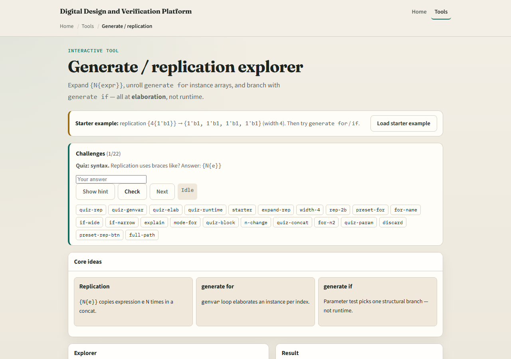
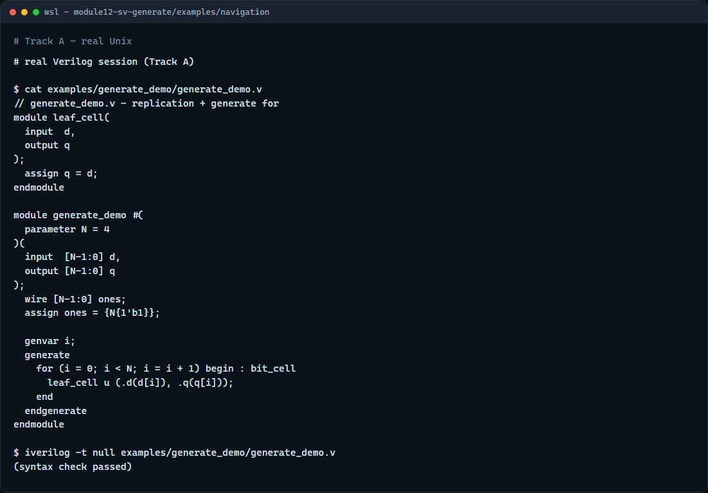

# Module 12 — Generate and replication

**Module id:** module12-sv-generate  
**Lab:** sv-generate  
**Tracks:** A · B

## Slide 1 — Generate and replication

Verilog gives you two related ideas that sound like loops but run at elaboration, not on every clock edge. Replication brace-N-brace-expression copies an expression N times inside a concatenation—brace-four-brace one-prime-b-one becomes four copies of one. Generate blocks use parameters and genvar to build structure: a for loop that instantiates one cell per index, or an if that keeps exactly one branch. This module is that toolbox—when to replicate bits versus when to replicate hierarchy.

## Slide 2 — Elaboration, not runtime

Replication is expression math: brace-N-brace expr widens a bus by repeating expr. Generate for uses a genvar index from zero to N minus one and elaborates one instance per pass—bit cell open-bracket i close-bracket dot u, and so on. Generate if tests a parameter or localparam at elaboration and discards the other branch entirely. That is different from a for loop inside always at-star, which runs during simulation. Generate conditions must be constants known before simulation starts—not ordinary signals that change every cycle.

## Slide 3 — Browser lab



In the browser lab track, open the generate-replication explorer from the tools page. Pick a mode—replication, generate for, or generate if—and set N or WIDTH. Load the starter with brace-four-brace one-prime-b-one, hit Expand, and read the bit width. Switch to generate for and see instance names unroll. Try generate if with WIDTH eight versus two and watch which branch elaborates. Work the challenges, then use Check.

## Slide 4 — Real Verilog practice



In the real Verilog track, open this module’s examples folder. The sketch assigns a bus of all ones with replication, then uses generate for with a genvar to instantiate one cell per bit. If Icarus is available, run a syntax-only compile—the lesson is elaboration-time structure, not a full testbench run.

```verilog
// generate_demo.v - replication + generate for
module leaf_cell(
  input  d,
  output q
);
  assign q = d;
endmodule

module generate_demo #(
  parameter N = 4
)(
  input  [N-1:0] d,
  output [N-1:0] q
);
  wire [N-1:0] ones;
  assign ones = {N{1'b1}};

  genvar i;
  generate
    for (i = 0; i < N; i = i + 1) begin : bit_cell
      leaf_cell u (.d(d[i]), .q(q[i]));
    end
  endgenerate
endmodule

// iverilog -t null generate_demo.v - syntax check only
```

## Slide 5 — Pitfalls to watch

Do not confuse replication brace-N-brace with generate for—they solve different problems. Do not put a runtime signal in a generate if condition—use parameters or localparams. Do not expect generate for to behave like a procedural for loop inside always. Do name generate blocks when you need hierarchical paths like bit_cell open-bracket i close-bracket dot u in waveforms and lint reports.

## Slide 6 — Your turn

Complete the checklist for at least one track—preferably both. In the browser, expand brace-four-brace one-prime-b-one and state the resulting bit width. On real Verilog, write a generate for that instantiates N copies of a leaf cell. When you are ready, take the short quiz, then continue to one-driver nets in the next module.
