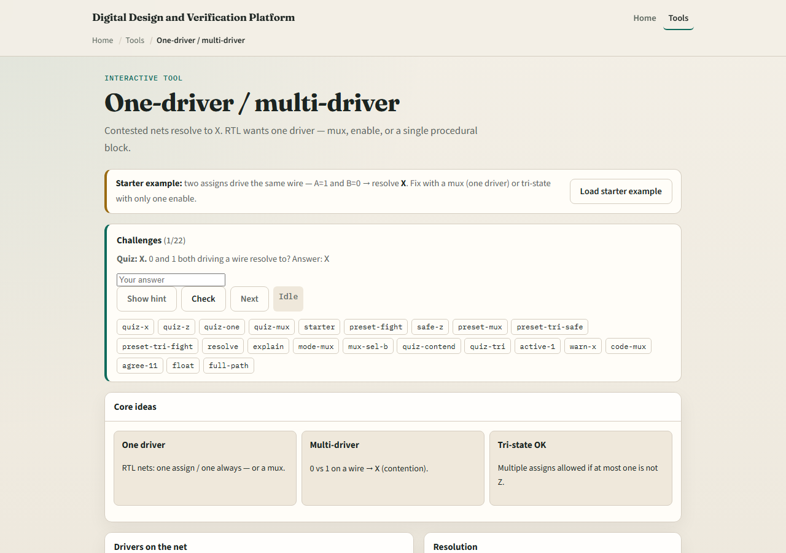
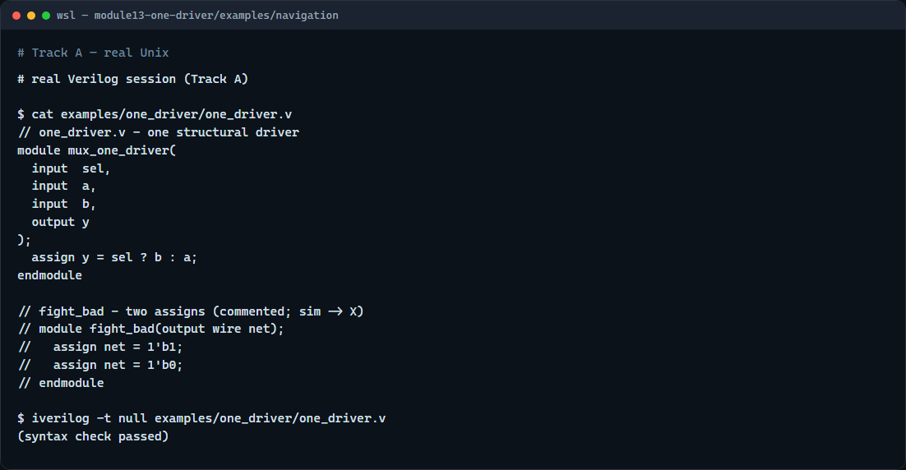

# One-driver nets

A wire or logic net should have at most one active driver in ordinary RTL

---

## Fight, mux, or tri-state
- Two assigns on the same net both pushing one and zero is the classic fight, net becomes X
- A mux assign net equals sel question-mark b colon a is still one driver structurally
- Tri-state uses enables: when off, the driver outputs Z so another may drive
- That is fine on a bus if enables are mutually exclusive
- Two always blocks writing the same reg is the procedural version of the same mistake

---

## Browser lab

---

## Real Verilog practice

---

## Pitfalls to watch
- Do not wire two outputs onto the same net without tri-state discipline
- Do not assume synthesis will merge conflicting assigns, it may not match your intent
- Do not use tri-state on internal FPGA fabric when a mux is clearer
- Do not let two clocked always blocks drive the same variable

---

## Your turn
- Complete the checklist for at least one track, preferably both
- In the browser
- On real Verilog, rewrite a contested net using one assign with a mux
- When you are ready

