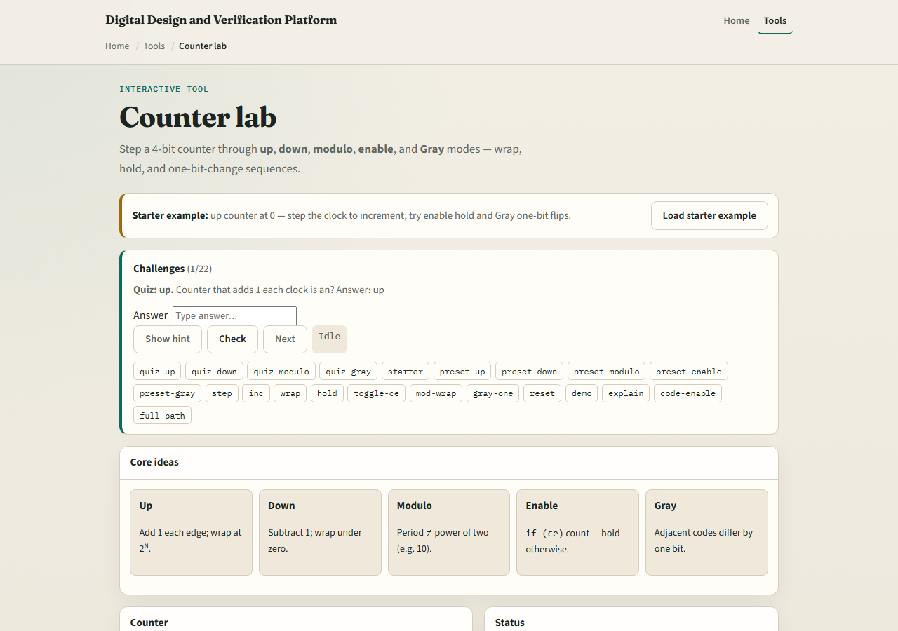
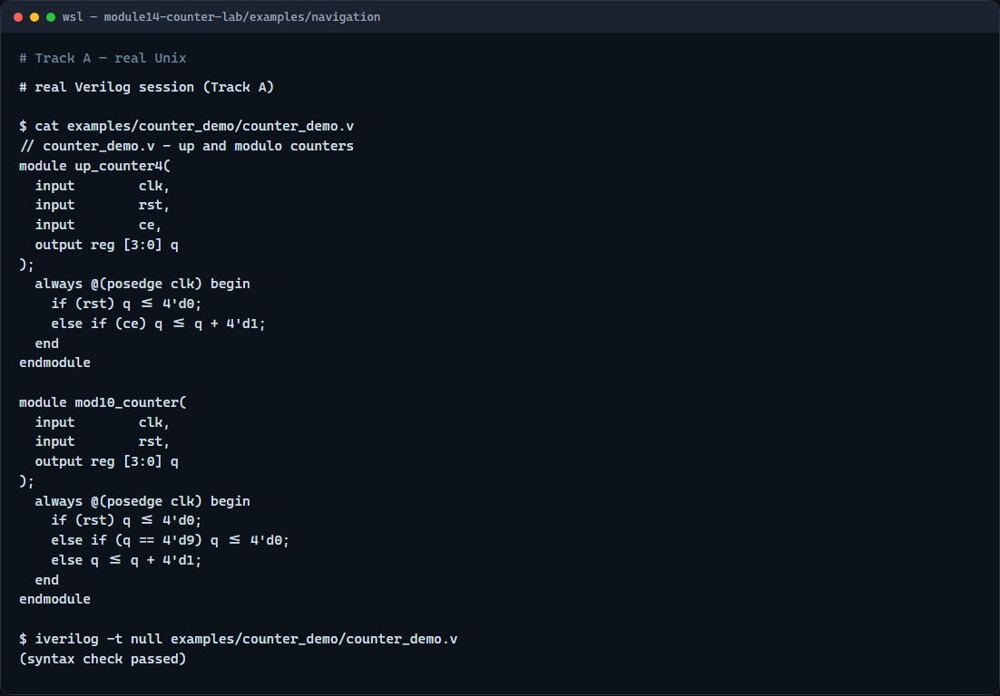

# Module 14 — Counter patterns

**Module id:** module14-counter-lab  
**Lab:** counter-lab  
**Tracks:** A · B

## Slide 1 — Counter patterns

Counters are small sequential machines that change state on each clock edge. The simplest pattern is an up counter that adds one and wraps when the register width overflows. From there you get down counters, modulo counters that wrap at a chosen limit, count-enable versions that hold when CE is zero, and Gray counters where only one output bit changes per step. This module is that family of patterns and when to use each one.

## Slide 2 — Count, wrap, or hold

A four-bit up counter naturally wraps from fifteen back to zero because the register width is fixed. A down counter subtracts one and wraps under zero back to fifteen. A modulo-ten counter checks for nine, then reloads zero on the next edge. Count enable is the preferred hold pattern: if CE is one, increment; otherwise keep the old value. Gray counting is different from plain binary because adjacent codes flip one bit, which is useful when you care about safer transitions between states.

## Slide 3 — Browser lab



In the browser lab track, open the counter lab from the tools page. The starter begins as an up counter at zero, with buttons to step the clock, reset, toggle CE, and switch among up, down, modulo, enable, and Gray modes. Step a few cycles and watch the binary value, wrap behavior, and changed bits. Then try enable mode with CE low so the count holds, and switch to Gray mode to see one-bit transitions. Work the challenges, then use Check.

## Slide 4 — Real Verilog practice



In the real Verilog track, open this module's examples folder. One sketch is a four-bit up counter with synchronous reset and count enable. The second is a modulo-ten counter that wraps explicitly at nine. If Icarus is available, run a syntax-only compile; the goal is recognizing clean sequential counter structure with non-blocking updates.

```verilog
// counter_demo.v - up and modulo counters
module up_counter4(
  input        clk,
  input        rst,
  input        ce,
  output reg [3:0] q
);
  always @(posedge clk) begin
    if (rst) q <= 4'd0;
    else if (ce) q <= q + 4'd1;
  end
endmodule

module mod10_counter(
  input        clk,
  input        rst,
  output reg [3:0] q
);
  always @(posedge clk) begin
    if (rst) q <= 4'd0;
    else if (q == 4'd9) q <= 4'd0;
    else q <= q + 4'd1;
  end
endmodule

// iverilog -t null counter_demo.v - syntax check only
```

## Slide 5 — Pitfalls to watch

Do not use blocking assignment in clocked counter RTL. Do not forget the explicit wrap condition for modulo counters that are not powers of two. Do not implement hold by assigning from multiple drivers; use one always block with a CE branch. Do not confuse Gray count outputs with ordinary binary values—the visual pattern is different on purpose.

## Slide 6 — Your turn

Complete the checklist for at least one track—preferably both. In the browser, step the modulo mode until it wraps and explain why it returns to zero. On real Verilog, write an enabled counter that holds when CE is low. When you are ready, take the short quiz, then continue to shift-register patterns in the next module.
