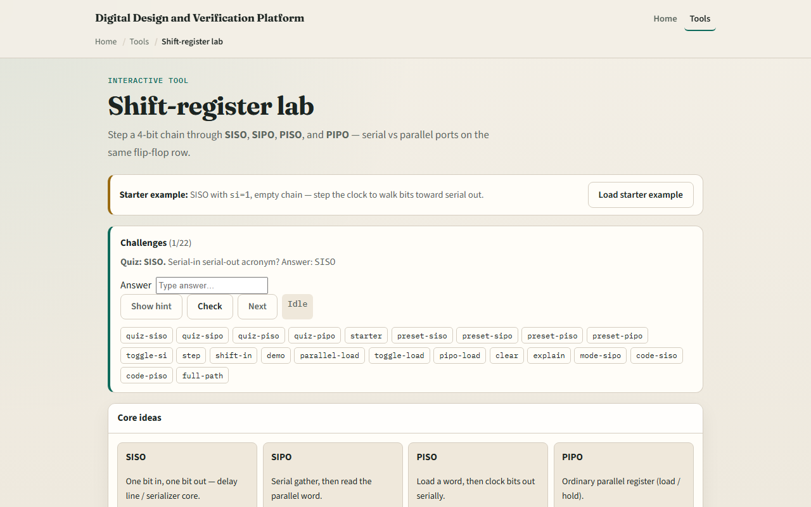
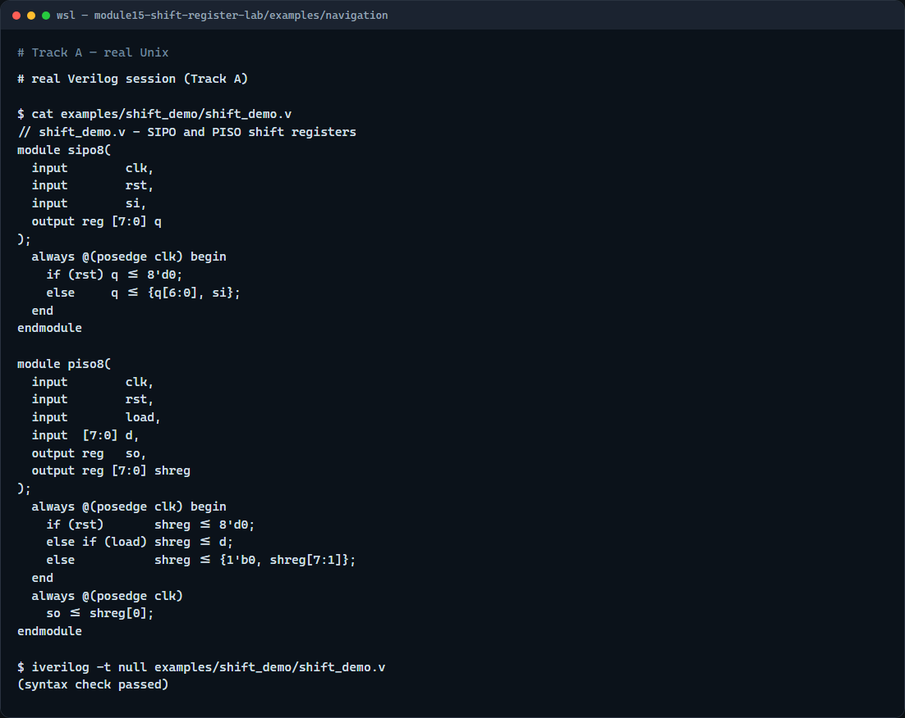

# Module 15 — Shift-register patterns

**Module id:** module15-shift-register-lab
**Lab:** shift-register-lab
**Tracks:** A · B

## Slide 1 — Shift-register patterns

A shift register is a chain of flip-flops where each stage passes its value to the next one on every clock edge. That simple idea is used everywhere: serial-to-parallel conversion, parallel-to-serial output, pipeline delay lines, and pattern detectors. This module walks through the main patterns — serial-in serial-out, serial-in parallel-out, parallel-in serial-out, and the ring variant — so you can recognize and write each one.

## Slide 2 — How shifting works

On each rising edge, each flip-flop captures the output of the flip-flop to its left. The leftmost stage captures the serial input. After N clock cycles an N-bit shift register has moved each bit N positions to the right. For parallel output, you read all stages at once. For parallel load, you latch external data into every stage simultaneously and then clock bits out one at a time. The ring version connects the last stage back to the first, so the bit pattern circulates indefinitely.

## Slide 3 — Browser lab



In the browser lab track, open the shift-register lab from the tools page. The starter shows an eight-bit shift register with a serial input, a clock step button, and a row of output bits. Click serial input on or off, step the clock a few times, and watch your bit move right through the chain. Then try parallel load to fill all stages at once, and switch to ring mode to watch bits cycle. The challenges ask you to trace specific sequences and explain what you observe.

## Slide 4 — Real Verilog practice



In the real Verilog track, open this module's examples folder. One sketch is an eight-bit serial-in parallel-out shift register with synchronous reset. The second is a parallel-in serial-out variant with a load signal. Notice that both use non-blocking assignment in the always block, and the SIPO just chains the concatenation operator to shift in one bit per cycle. If Icarus is available, run a syntax-only compile to confirm the module structure.

```verilog
// shift_demo.v - SIPO and PISO shift registers
module sipo8(
  input        clk,
  input        rst,
  input        si,
  output reg [7:0] q
);
  always @(posedge clk) begin
    if (rst) q <= 8'd0;
    else     q <= {q[6:0], si};
  end
endmodule

module piso8(
  input        clk,
  input        rst,
  input        load,
  input  [7:0] d,
  output reg   so,
  output reg [7:0] shreg
);
  always @(posedge clk) begin
    if (rst)       shreg <= 8'd0;
    else if (load) shreg <= d;
    else           shreg <= {1'b0, shreg[7:1]};
  end
  always @(posedge clk)
    so <= shreg[0];
endmodule

// iverilog -t null shift_demo.v - syntax check only
```

## Slide 5 — Pitfalls to watch

Do not use blocking assignment inside a clocked shift register; you will get combinational ripple instead of registered delay. Do not forget to account for the latency: an N-stage shift register introduces N clock cycles of delay, which can cause timing surprises in larger designs. When connecting stages manually instead of using a concatenation, make sure you reference the old value, not the already-updated one — that is exactly the non-blocking assignment guarantee. And when using a ring, verify the feedback path or you may lose bits silently.

## Slide 6 — Your turn

Complete the checklist for at least one track, ideally both. In the browser lab, step a ring register long enough to see your starting pattern return to stage zero. In real Verilog, extend the SIPO to sixteen bits and verify it still synthesizes cleanly with a null compile. When you finish, take the short quiz, and then move on to synthesizability lint in the next module.
