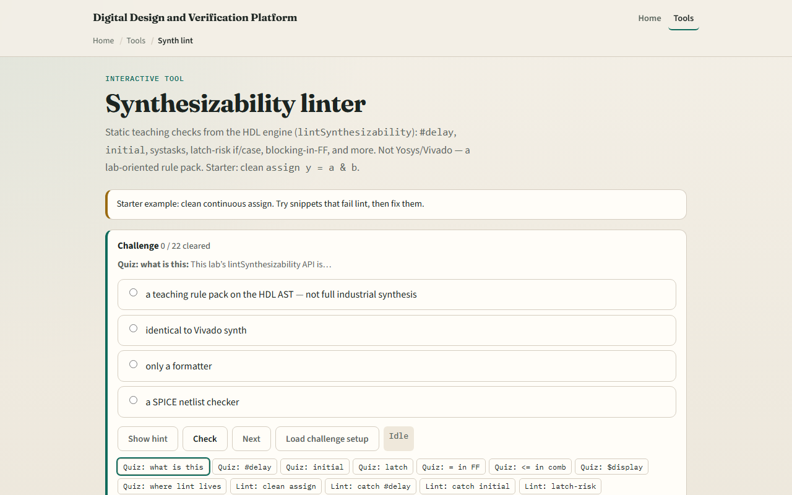
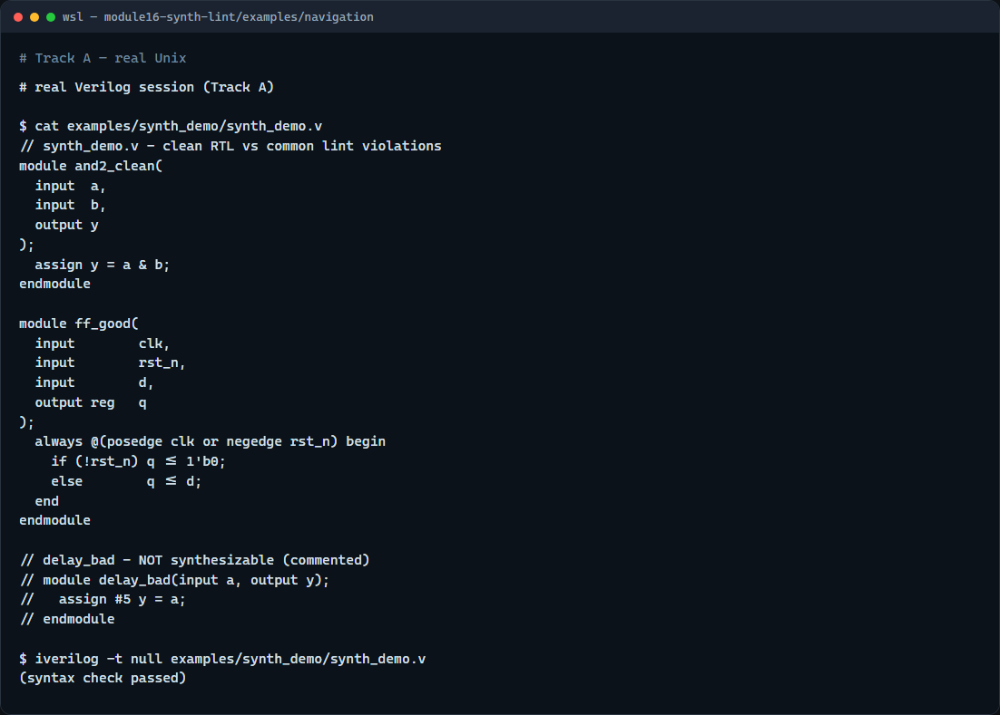

# Synthesizability lint

Not every Verilog fragment that simulates cleanly will synthesize to real gates

---

## What the linter catches
- The teaching rule pack covers the most common classroom mistakes
- Hash-delay on assigns or gates is simulation timing, not hardware
- Initial blocks and dollar-display tasks belong in testbenches, not RTL modules
- An always-at-star if without else can infer a latch
- Inside an always-ff clocked block, use non-blocking assignment for register outputs
- Inside always-comb, use blocking assignment instead

---

## Browser lab

---

## Real Verilog practice

---

## Pitfalls to watch
- Do not treat a green simulation as proof of synthesizability
- Do not copy testbench patterns like dollar-display into RTL modules
- Do not mix blocking and non-blocking styles inside the same clocked always block
- Do not assume this teaching linter replaces industrial tools like Yosys or Vivado
- Run lint early and fix findings before you commit

---

## Your turn
- Complete the checklist for at least one track, ideally both
- In the browser lab, load the latch snippet and name the rule that fires
- Any delays, initial blocks, or incomplete branches?
- When you finish, take the short quiz, then continue to HDL style in the next module

