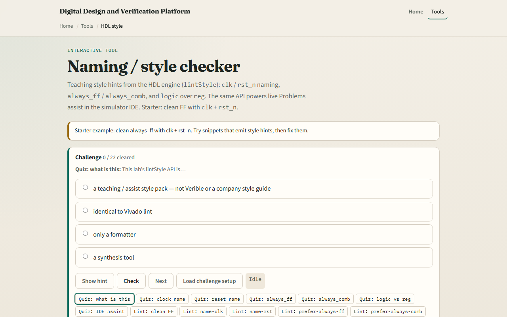
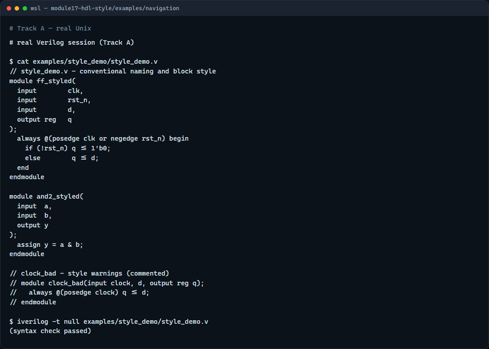

# HDL style

Synthesizability lint asks whether your code can become gates

---

## Naming and block keywords
- Clock nets should be named clk or end with underscore clk so every reader spots the timing
- Active-low reset should use rst_n or reset_n
- For edge-triggered registers, SystemVerilog prefers always_ff over plain always at posedge
- For combinational procedural logic, prefer always_comb over always at-star
- For new RTL, prefer logic over reg when your toolchain supports it
- These are info-level hints in the teaching linter

---

## Browser lab

---

## Real Verilog practice

---

## Pitfalls to watch
- Do not confuse style hints with synthesizability errors
- Do not rename signals randomly; pick one convention per project and stick to it
- The keyword choice documents intent
- It teaches the categories you will see in real review tools

---

## Your turn
- Complete the checklist for at least one track, ideally both
- In the browser lab, load the clock-not-clk snippet and fix it until name-clk disappears
- In real Verilog
- When you finish

