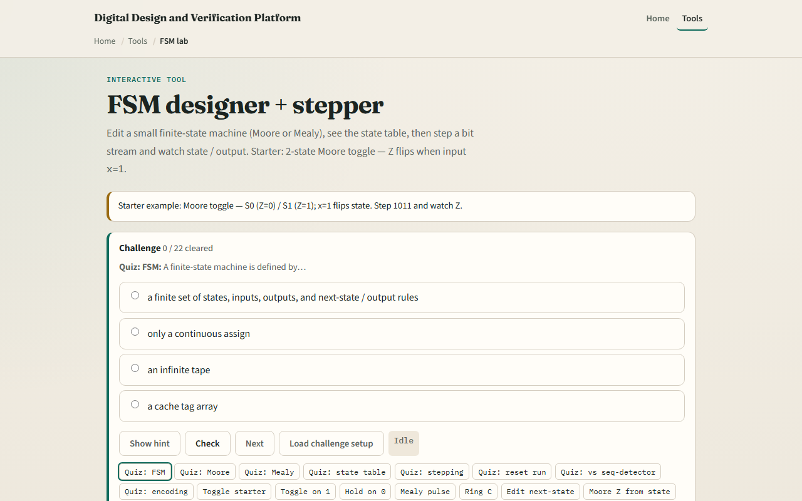
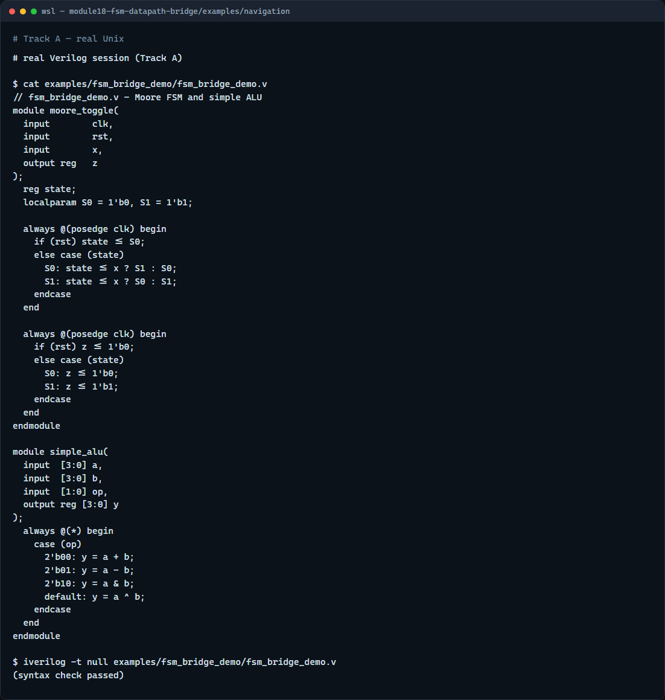

# Module 18 — FSM & datapath in RTL

**Module id:** module18-fsm-datapath-bridge
**Lab:** none (bridge — reuse fsm-lab, alu-explorer, mem-map)
**Tracks:** A · B

## Slide 1 — FSM and datapath in RTL

You have already met finite-state machines, ALU datapaths, and memory maps as digital concepts. This bridge module connects those ideas to Verilog you can write and simulate. An FSM is the control: it decides what happens on each clock cycle. The datapath is the arithmetic and logic that does the work. Memory holds operands and results. Real RTL combines all three — and now you translate browser-lab behavior into modules, ports, and always blocks.

## Slide 2 — Control plus datapath

In RTL, the FSM usually lives in a clocked always block with a case on the current state. Next-state logic and Moore outputs can share that block or split for clarity. The datapath is mostly combinational: muxes select operands, an ALU computes, and registers capture results on the clock edge. A memory map in hardware is a register file or RAM block addressed by an index. You do not need a perfect one-to-one copy of every lab UI — you need a sketch that shows the same separation of control, compute, and storage.

## Slide 3 — Revisit the concept labs



In the browser track, reopen one of the concept labs you used in learn digital: the FSM designer for state tables and stepping, the ALU explorer for opcodes and flags, or the memory map for read and write by address. Load the starter, step through a few cycles, and note what the control does versus what the datapath computes. Your job is to imagine the Verilog module that would produce the same behavior — ports for clk, reset, inputs, and outputs, with an always block for state and assign or always-at-star for combo logic.

## Slide 4 — Real Verilog practice



In the real Verilog track, open this module's examples folder. One sketch is a two-state Moore machine that toggles output z when input x is high — the same pattern as the FSM lab starter. The second is a tiny four-bit ALU with a case on opcode, matching the spirit of the ALU explorer. If Icarus is available, run a syntax-only compile to confirm both modules parse.

```verilog
// fsm_bridge_demo.v - Moore FSM and simple ALU
module moore_toggle(
  input        clk,
  input        rst,
  input        x,
  output reg   z
);
  reg state;
  localparam S0 = 1'b0, S1 = 1'b1;

  always @(posedge clk) begin
    if (rst) state <= S0;
    else case (state)
      S0: state <= x ? S1 : S0;
      S1: state <= x ? S0 : S1;
    endcase
  end

  always @(posedge clk) begin
    if (rst) z <= 1'b0;
    else case (state)
      S0: z <= 1'b0;
      S1: z <= 1'b1;
    endcase
  end
endmodule

module simple_alu(
  input  [3:0] a,
  input  [3:0] b,
  input  [1:0] op,
  output reg [3:0] y
);
  always @(*) begin
    case (op)
      2'b00: y = a + b;
      2'b01: y = a - b;
      2'b10: y = a & b;
      default: y = a ^ b;
    endcase
  end
endmodule

// iverilog -t null fsm_bridge_demo.v - syntax check only
```

## Slide 5 — Pitfalls to watch

Do not put combinational next-state logic in the same always block with blocking assignment mixed into registered outputs — keep clocked and combo roles clear. Do not forget a default state after reset or synthesis may latch undefined behavior. Do not assume the browser lab is the only spec — write ports and signal names that make the design readable on their own. And do not skip the memory-map lab entirely; even a one-line register array in Verilog reinforces how address maps to storage.

## Slide 6 — Your turn

Complete the checklist. Pick one concept lab, load the starter, and outline a Verilog module with matching ports. Write at least a module shell and one always or assign block. Optionally run iverilog or the browser HDL simulator on your sketch. When you finish, take the short quiz, then continue to the course wrap in the next module.
