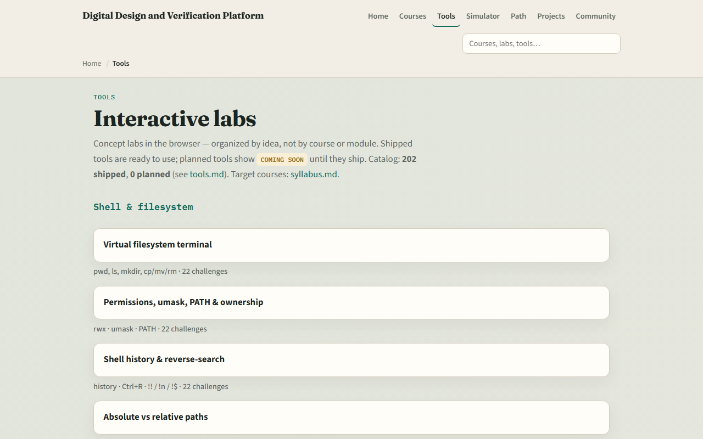

# Verilog path complete

You have walked the Verilog RTL path, from modules and ports, through wire versus reg, sensitivity lists, latch risk

---

## What you can do now
- You can sketch modules, ports, and literals in IEEE 1364 style
- You can choose wire or reg appropriately and avoid latch risk and sensitivity bugs
- You can parameterize widths, generate instances, and keep one driver per net
- You can write small sequential blocks with non-blocking updates for counters and shift
- You can run style and synthesizability checks before you push RTL
- That is the coding literacy every later SystemVerilog and simulation course expects

---

## Close the track gaps
- Lint, so ports and always blocks feel like work you will keep
- One-driver nets
- Either track works for self-study; both together stick best before you move on

---

## The tools you practiced
- Here is the tools index again, the same shelf of concept labs you opened along the way
- You do not need to re-clear every challenge
- Use it as a map

---

## Next
- Complete the quiz for this part
- Continue to learn SystemVerilog for design constructs beyond plain Verilog

---

## Your turn
- Review the wrap checklist in the module README
- Confirm you can explain wire versus reg and blocking versus non-blocking without guessing
- When you are ready

